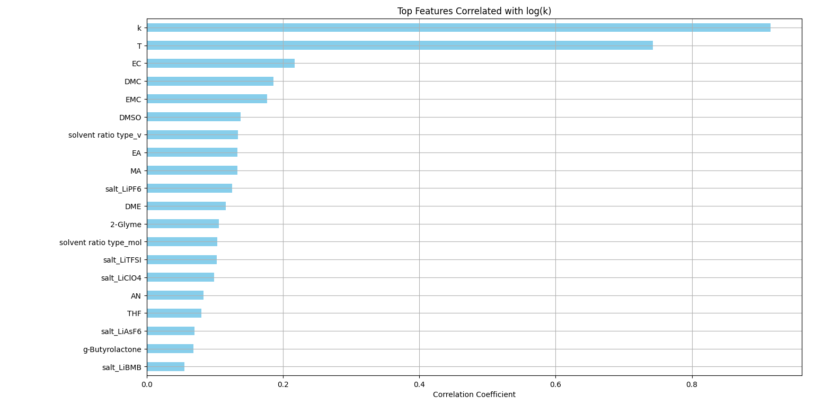
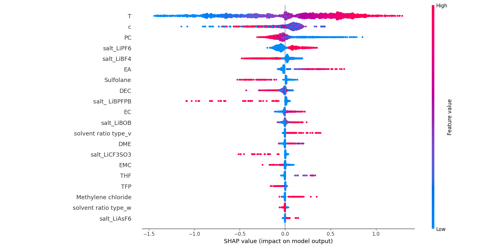
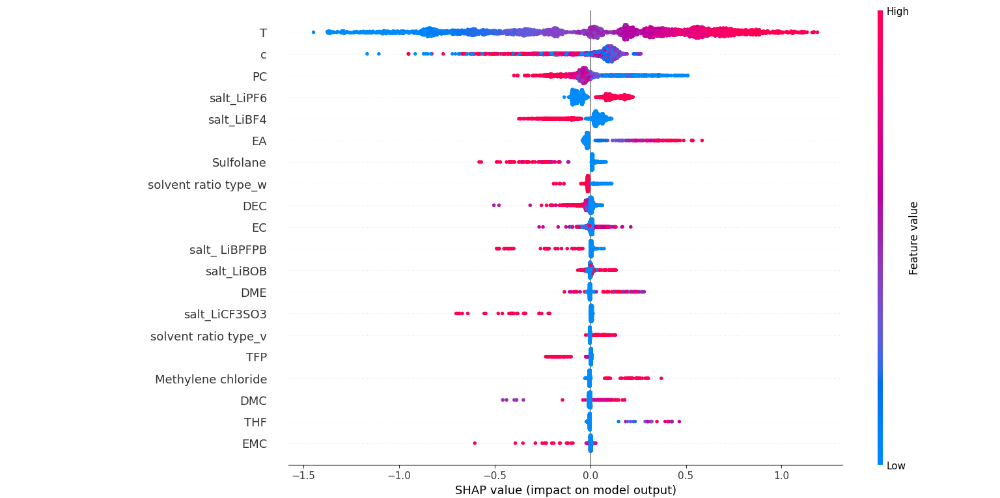
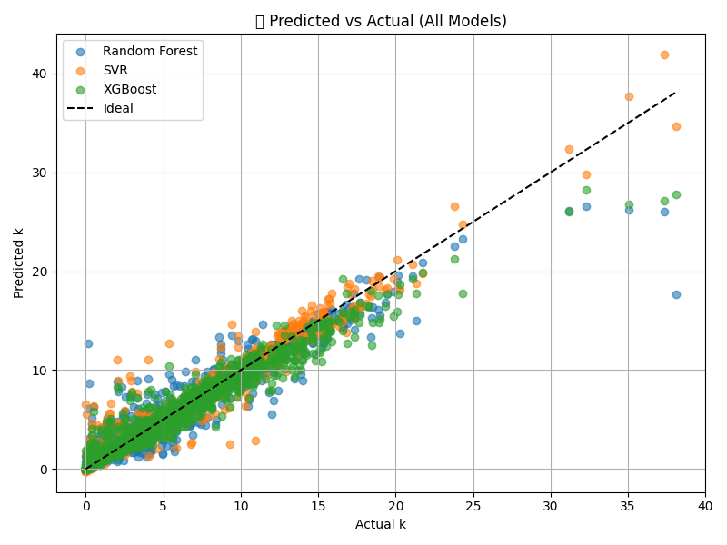
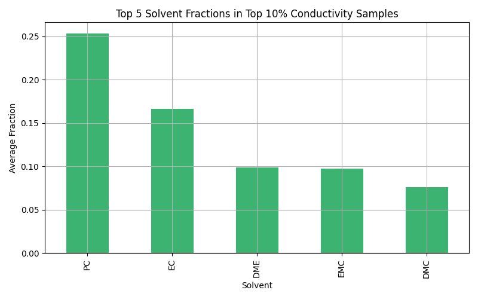
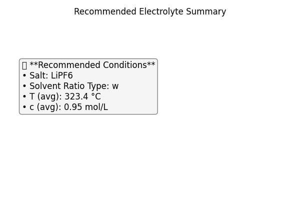

# 🔋 CALiSol‑23: Ionic Conductivity Prediction  
> *Machine learning-based prediction of lithium-ion electrolyte conductivity using the CALiSol‑23 dataset.*

[](https://creativecommons.org/licenses/by/4.0/)

## 🔍 Overview
This project explores how machine learning can predict the ionic conductivity of lithium-ion electrolytes based on experimental composition data.
We utilize the **CALiSol‑23 dataset** and apply multiple regression models with SHAP analysis interpretation and optimal composition recommendation.

## 🎯 Objective
As a first-year chemical engineering student, I aimed to apply machine learning to real-world experimental data and extract meaningful chemical insights from it. 
This project helped me understand the relationship between composition and conductivity, while gaining hands-on experience in end-to-end modeling.

## 📁 Project Structure

bash
calisol23-ionic-conductivity/
├── data/
│   └── calisol23.xlsx          # (ignored by .gitignore, local only)
├── images/
│   ├── correlation_top20.png
│   ├── shap_rf_summary.png
│   ├── shap_xgb_summary.png
│   ├── parity_plot_all_models.png
│   ├── top10_recommendation.png
│   └── top10_recommendation.summary.png
├── results/
│   └── model_performance.csv
├── src/
│   └── calisol23_modeling.py   # Main modeling script
├── .gitignore                  # Ignore rules for local files (e.g., .xlsx, __pycache__)
├── requirements.txt           # Python dependencies
└── README.md                  # Project documentation

## 📊 Dataset Information
This project uses the CALiSol‑23 dataset, which contains experimental ionic conductivity data for various lithium salt and solvent combinations.

| Item        | Detail                                                                                     |
|-------------|---------------------------------------------------------------------------------------------|
| **Name**    | CALiSol‑23                                                                                  |
| **Citation**| Mortensen et al., *Scientific Data* (2024)                                                  |
| **DOI**     | [10.1038/s41597-024-03575-8](https://doi.org/10.1038/s41597-024-03575-8)                    |
| **Source**  | [Scientific Data (Nature)](https://doi.org/10.1038/s41597-024-03575-8)                                    |
| **License** | [CC BY 4.0](https://creativecommons.org/licenses/by/4.0/)                                   |

This dataset is freely available for redistribution and modification, provided that appropriate credit is given.

## ⚙️ Models Used
- Random Forest Regressor
- Support Vector Regression (SVR)
- XGBoost Regressor

 Each model was trained on:

✅ Full Feature Set

✅ Top-5 Selected Features (from SHAP + Correlation)

## 📈 Correlation Analysis


This plot helps identify features with strong linear correlation to ionic conductivity, serving as a basis for feature selection.

## 🔬 Feature Importance (SHAP Analysis)

### 🔬 SHAP Summary — Random Forest


### 🔬 SHAP Summary — XGBoost



#### 📌 SHAP Interpretation Summary
Temperature (T) was the most influential feature. Higher temperatures enhance ion mobility, leading to increased ionic conductivity.
Salt concentration (c) also played a key role, but its effect was non-linear — conductivity peaked at an optimal concentration.

Propylene Carbonate (PC) and Ethylene Carbonate (EC) were the most important solvents due to their high polarity and ion dissociation capabilities.
These carbonate-based solvents are commonly used to enhance lithium ion transport.

LiPF₆ and LiBF₄ were the most relevant lithium salts, both widely adopted in commercial electrolyte formulations.
The solvent ratio type (categorical) also influenced conductivity, indicating formulation-dependent effects.

## 📊 Model Performance

### 📈 Model Comparison

| Model                   |   R²     |   MSE    |   MAE    |
|-------------------------|----------|----------|----------|
| RandomForest (Full)     | 0.9384   | 1.0933   | 0.4274   |
| RandomForest (Selected) | 0.8087   | 3.3955   | 0.7645   |
| SVR (Full)              | 0.9623   | 0.6698   | 0.4288   |
| SVR (Selected)          | 0.7861   | 3.7972   | 0.7935   |
| XGBoost (Full)          | 0.9513   | 0.8642   | 0.5076   |
| XGBoost (Selected)      | 0.8269   | 3.0736   | 0.7550   |

📁 See full table: [results/model_performance.csv](./results/model_performance.csv)

📈 Parity Plot (All Models)



This scatter plot visualizes the agreement between actual and predicted values for each model.
XGBoost and SVR perform particularly well with low scatter.

#### 📌 Model Comparison Summary
The SVR (Full) model achieved the highest R² (0.9623) and the lowest MSE, showing that a linear decision boundary in high-dimensional space fits this data well.
The XGBoost (Full) model also performed strongly (R² = 0.9513), making it the best-performing tree-based model.

When limited to the top-5 selected features, all models showed a significant drop in accuracy, indicating that key interactions may be lost when simplifying input variables.

Among all candidates, XGBoost demonstrated the best balance between accuracy and interpretability, making it a reliable and robust choice.

These findings align with established battery chemistry, where carbonate solvents and specific lithium salts are known to enhance conductivity.

## 🧪 Recommendation System

The top 10% of conductivity samples were analyzed to extract the most frequent composition patterns and optimal conditions.

### 🧪 Top Solvent Fractions in High-Conductivity Samples


This bar chart shows the average solvent fractions among the top 10% highest conductivity samples.  
**PC**, **EC**, and **DME** were most frequently used in high-performance compositions.

### 📋 Recommended Electrolyte Summary


This summary box presents the optimal electrolyte condition based on the top-performing 10% samples:

- **Salt**: LiPF₆  
- **Solvent Ratio Type**: w  
- **Average Temperature**: 323.4 °C  
- **Average Concentration**: 0.95 mol/L

These conditions reflect the most commonly observed trends in high-performance samples.  
Notably, LiPF₆ salt and PC-rich solvents yielded consistently higher conductivity.

## 📦 Installation

Tested with: Python 3.11

Clone the repository and install required dependencies:

```bash
git clone https://github.com/Kyeongbin-Tom/calisol23-ionic-conductivity.git
cd calisol23-ionic-conductivity
pip install -r requirements.txt
```

## 🏃‍♂️ How to Run

```bash
python src/calisol23_modeling.py

This script will:
  - Preprocess the CALiSol‑23 dataset
  - Train SVR, Random Forest, and XGBoost models
  - Generate SHAP plots and performance comparison
  - Recommend top electrolyte compositions based on top 10% conductivity samples
```

## ✨ Future Improvements

  - Hyperparameter tuning (GridSearchCV, Optuna)
  - More advanced models (CatBoost, LightGBM)
  - SHAP dependence plots for continuous variables
  - External validation with other electrolyte datasets

## 📜 License
This project is licensed under the Creative Commons Attribution 4.0 International (CC BY 4.0), which allows sharing and adaptation with attribution.
